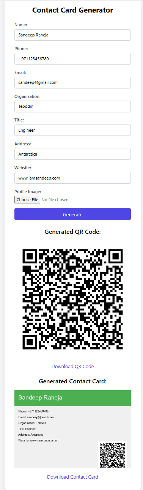

# Contact Card QR Code Generator

This project is a web application that generates a vCard QR code and a contact card image based on user input. The application is built using Flask for the backend and HTML/CSS for the frontend.


## Features

- **Generate vCard QR Code**: Create a QR code containing contact details in vCard format.
- **Generate Contact Card**: Create a contact card image with the QR code and contact details.
- **Downloadable Images**: Download the generated QR code and contact card as PNG images.
- **Error Handling**: Proper validation and error handling for user inputs, including phone number, email, and website URL formats.
- **Profile Image Upload**: Option to upload a profile image to be included in the contact card.

## How It Works

1. **User Input**: The user fills out a form with their contact details, including name, phone number, email, organization, title, address, website, and an optional profile image.
2. **Form Submission**: Upon form submission, the data is sent to the Flask backend.
3. **QR Code Generation**: The backend generates a vCard QR code based on the provided contact details.
4. **Contact Card Generation**: The backend creates a contact card image, including the QR code and contact details.
5. **Display and Download**: The generated QR code and contact card images are displayed on the frontend, with options to download them as PNG files.

## Installation

### Requirements

- Python 3.7+
- Flask
- Pillow
- qrcode
- WTForms
- Flask-WTF
- email_validator

### Setup

1. **Clone the repository**

2. **Install dependencies**:
    ```sh
    pip install -r requirements.txt
    ```

3. **Run the application**:
    ```sh
    python app.py
    ```

4. **Access the application**:
    Open your web browser and navigate to `http://127.0.0.1:5000`.

## Usage

1. Fill out the form with your contact details.
2. Click the "Generate" button.
3. View the generated QR code and contact card.
4. Download the images by clicking the download links.

## Error Handling

- **Phone Number**: Validates phone number format.
- **Email**: Validates email address format.
- **Website URL**: Validates website URL format, ensuring it starts with `http://`, `https://`, or `www.` and includes a valid domain name.

## Example

Here is an example of the form filled out with sample data:

- **Name**: John Doe
- **Phone**: +123456789
- **Email**: johndoe@example.com
- **Organization**: Example Inc.
- **Title**: Software Engineer
- **Address**: 123 Example St, Example City
- **Website**: https://example.com
- **Profile Image**: Upload a profile image file

After clicking "Generate", the QR code and contact card images will be displayed and available for download.

 

## License

This project is licensed under the MIT License. See the [LICENSE](LICENSE) file for details.